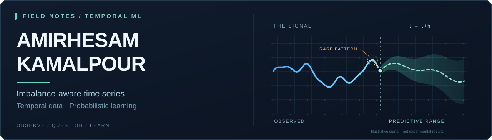

  

  <a href="https://scholar.google.com/citations?user=0mZFjTwAAAAJ&hl=en">Google Scholar</a>
  &nbsp;·&nbsp;
  <a href="https://www.linkedin.com/in/amirhesam-kamalpour/">LinkedIn</a>
  &nbsp;·&nbsp;
  <a href="mailto:amirhesam.kamalpour@gmail.com">Email</a>
  &nbsp;·&nbsp;
  <a href="https://orcid.org/0009-0006-8299-7693">ORCID</a>

### About

I'm **AmirHesam Kamalpour**, an **M.Sc. student in Artificial Intelligence at the University of Tehran**, with a **B.Sc. in Computer Engineering from Allameh Tabataba'i University**.

My current research explores **imbalance-aware time-series learning**: how machine learning models can learn reliably when important temporal patterns or outcomes are underrepresented. My broader interests include **probabilistic forecasting**, **generative models for time series**, and **deep learning**.

I like turning research questions into clear formulations, reproducible experiments, and working implementations.

### 01 / Current research

**Imbalance-aware time-series learning** · *Ongoing*

A question guiding my current work:

> How can we build temporal models that learn reliably when important patterns or outcomes are rare or underrepresented?

I'm exploring the modeling and evaluation challenges of imbalance in sequential data. Possible directions include **class imbalance**, **rare-event modeling**, and **imbalanced forecasting**; the exact research formulation is still evolving. I'll share methods and results as the work develops.

### 02 / Selected work

**[TimeGrad · Probabilistic time-series forecasting](https://github.com/AmirHesamKamalpour/TimeGrad-PyTorch-Collaborative-Research-Project)**  
*Collaborative research implementation with Aida Roshani.*  
A modular PyTorch reproduction of TimeGrad for multivariate probabilistic forecasting with diffusion models. The repository includes evaluation on five benchmark datasets and documents reproducibility considerations and experimental limitations.

**[Competitive Dynamic Pricing · Reinforcement learning](https://github.com/AmirHesamKamalpour/Competitive-Dynamic-Pricing-RL)**  
A Soft Actor-Critic approach to competitive pricing under stochastic demand, seasonality, and a reactive competitor.

**[CAT Trust-Region Method · Numerical optimization](https://github.com/AmirHesamKamalpour/CAT-Trust-Region-Method-Python-Implementation)**  
An independent Python implementation of an adaptive trust-region optimization method with modular subproblem solvers and CUTEst benchmarking.

### 03 / Publication

**[Deep Learning Models for Price Prediction in Travertine Stone Mines: A Comparison of LSTM, Transformer, and Hybrid Models](https://doi.org/10.22105/raise.v3i2.91)**  
Haniye Moazeni & **Amirhesam Kamalpour** · *Research Annals of Industrial and Systems Engineering*, 2026.  
A comparison of deep-learning approaches to industrial price prediction.

[See more on Google Scholar ↗](https://scholar.google.com/citations?user=0mZFjTwAAAAJ&hl=en)

### 04 / Education

- **M.Sc. in Artificial Intelligence** · University of Tehran · *Current*
- **B.Sc. in Computer Engineering** · Allameh Tabataba'i University

### 05 / Connect

[**Email ↗**](mailto:amirhesam.kamalpour@gmail.com) &nbsp;·&nbsp; [**Google Scholar ↗**](https://scholar.google.com/citations?user=0mZFjTwAAAAJ&hl=en) &nbsp;·&nbsp; [**LinkedIn ↗**](https://www.linkedin.com/in/amirhesam-kamalpour/) &nbsp;·&nbsp; [**GitHub repositories ↗**](https://github.com/AmirHesamKamalpour?tab=repositories)
